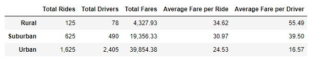
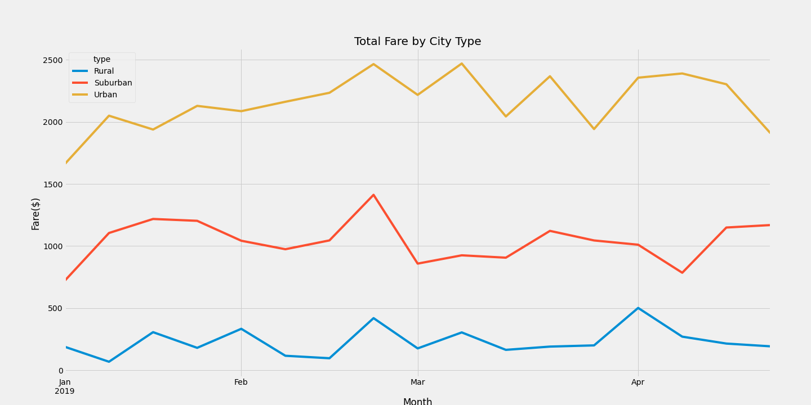

# Pyber_Analysis
The purpose of the ride share analysis is to identify key metrics and trends of total fares, average fare per ride, average fare per driver by type of city (urban, suburban, and rural).  With this data, the CEO can determine where there are opportunities to increase ride share coverage, set rates for peak and off peak times, and maximize income opportunities for all drivers while maintaining prices reasonable for customers. 

## Results
Urban cities had the greatest number of rides of all three city types with 1,625, followed by Suburban at 625, & Rural at 125. There were approximately 13 times more Urban rides than there were Rural rides. While the quantity of rides may seem impressive. It is important to understand how the number of rides affects fares for the customers and the driver. Even the Urban rides were the highest, Urban city also had the most number of drivers, almost double that of rides 2,405 drivers. The average fare per ride was $24.53 and the average fare per driver was $16.57. One might say that Urban cities are oversaturated. The increased competition drives down the fare per ride and also reduces the average fare by driver. This is in contrast to Rural Cities. The average fare per ride is $34.62, about $10 more than Urban city fare, but the average fare per driver is $55.49, 3 times more than the Urban city fare. There were less drivers so there is more opportunity for a driver to make more in Rural areas. There is also opportunity to in Suburban cities where there is demand for rides (625) and the amount of drivers (490) is less than that demand. The average fare per driver is double that of Urban cities at $39.50.

## Summary
As mentioned above the Urban city is oversaturated. With the number of drivers competing for fares is double the number of rides, a driver has to almost double the amount of rides they get to make any profit. First recommendation would be to optimize the number of divers out at a certain time (peak vs off-peak). Second recommendation would be to create incentives for drivers to services more of the Rural and Suburban areas and not concentrate on Urban areas. Third recommendation would be to optimize rates to avoid huge disparities between city types.
